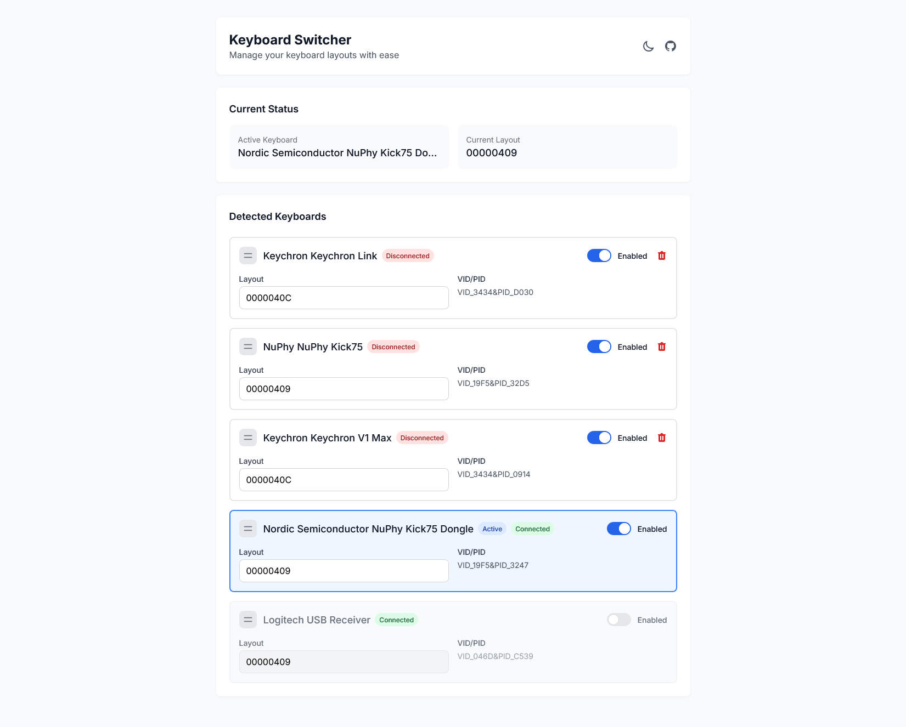
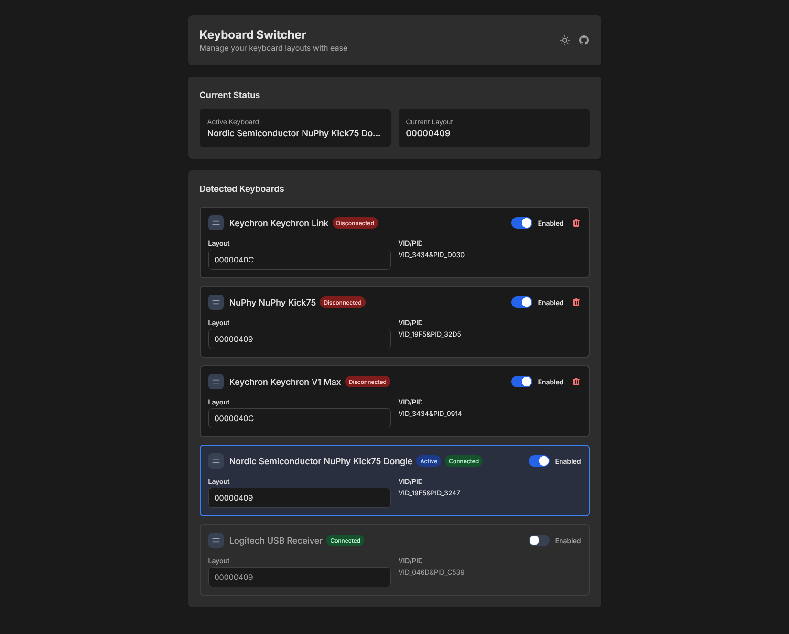

# Keyboard Switcher

**Keyboard Switcher** is a desktop utility and web interface that allows users to manage and automatically switch keyboard layouts based on connected physical keyboards. It features a live dashboard for monitoring keyboard status, layout assignments, and connection status.

### Dashboard Light


### Dashboard Dark


---

## Table of Contents

- [Introduction](#introduction)
- [Features](#features)
- [Installation](#installation)
- [Usage](#usage)
- [Configuration](#configuration)
- [Web Interface](#web-interface)
- [API Endpoints](#api-endpoints)
- [Dependencies](#dependencies)
- [Examples](#examples)
- [Troubleshooting](#troubleshooting)
- [Contributors](#contributors)
- [License](#license)

---

## Introduction

This tool is designed for Windows users who frequently switch between multiple keyboards with different layout preferences. By automatically detecting connected keyboards and assigning corresponding layouts, it ensures a seamless typing experience.

---

## Features
- Detects connected keyboards and their HWIDs
- Automatically switches Windows input language when a specific keyboard is connected
- Simple GUI to manage keyboard layout config

## Requirements
- Python 3.8+
- [pywinusb](https://pypi.org/project/pywinusb/)
- [wmi](https://pypi.org/project/WMI/)
- [tkinter](https://docs.python.org/3/library/tkinter.html) (standard library)

- Automatically detects connected keyboards.
- Assigns and switches Windows input language/layout based on the active keyboard.
- Web dashboard to view, configure, and reorder keyboards.
- Tray icon for quick access and visibility.
- Supports hot-plug detection and layout enforcement.
- Auto-saves and backs up configuration.

---

## Installation

1. Clone or download the repository.
2. Install dependencies using `pip`:
```bash
pip install -r requirements.txt
```

3. (Optional) Package the app as an executable:

```bash
pyinstaller --onefile --noconsole --add-data "templates;templates" --paths=venv/Lib/site-packages --hidden-import pythoncom --hidden-import pywinusb.hid main.py
```

---

## Usage

Run the main script:

```bash
python main.py
```

* The application will start a local Flask server and a tray icon.
* Access the web interface at [http://localhost:5000](http://localhost:5000).

---

## Configuration

The configuration file is `keyboard_config.json` and contains an array of keyboard objects with the following fields:

```json
{
  "name": "Keyboard Name",
  "product": "Product Name",
  "vendor": "Vendor Name",
  "vid_pid": ["VID_XXXX&PID_YYYY"],
  "layout": "00000409",
  "enabled": true,
  "connected": true,
  "active": false
}
```

* `layout`: A hex code representing the Windows input language (e.g., `00000409` for US English).
* `enabled`: Whether the keyboard is monitored for layout switching.
* `connected` and `active` are updated automatically.

Backups of configurations are stored in the `backups/` folder.

---

## Web Interface

The web interface provides:

* A real-time view of detected keyboards.
* Drag-and-drop reordering.
* Toggle enable/disable per keyboard.
* Dark/light mode toggle.
* Layout editing.

Technologies used:

* Vue 3
* Tailwind CSS
* Flask (backend)

---

## API Endpoints

* `GET /api/config` — Fetch keyboard config.
* `POST /api/config` — Save new keyboard config.
* `GET /api/status` — Get current active keyboard and layout.
* `GET /api/detected_keyboards` — List all known and newly detected keyboards.

---

## Dependencies

Python:

* `flask`
* `flask_cors`
* `pystray`
* `Pillow`
* `wmi`
* `pywinusb`
* `pythoncom`

Web:

* Vue 3 (CDN)
* Tailwind CSS (CDN)

---

## Examples

Example configuration entry:

```json
{
  "name": "Keychron Keychron V1 Max",
  "product": "Keychron V1 Max",
  "vendor": "Keychron",
  "vid_pid": ["VID_3434&PID_0914"],
  "layout": "0000040C",
  "enabled": true,
  "connected": false,
  "active": false
}
```

---

## Troubleshooting

* **No keyboards detected?**

  * Ensure the device is connected and recognized by Windows.
  * Run the script as Administrator for full hardware access.
* **Layout not switching?**

  * Check the configured layout codes.
  * Ensure the keyboard is marked as `enabled`.

---

## Contributors

* [Gaeritag](https://github.com/Gaeritag)

---

## License
MIT License 


This project is licensed under the MIT License.
